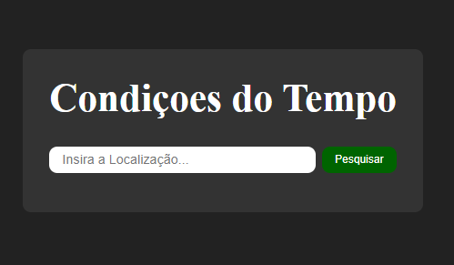
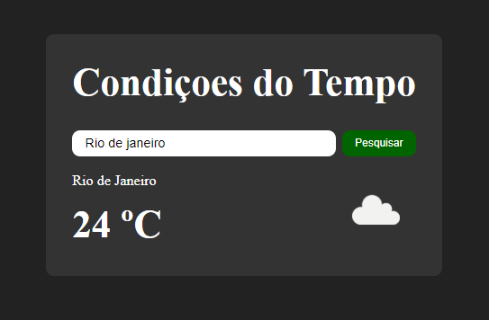
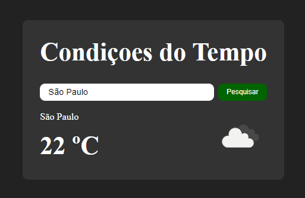

## Weather App (Pt-Br)

### Descrição
Esta é uma aplicação simples para obter informações meteorológicas de uma cidade usando a API do OpenWeatherMap. O usuário pode inserir o nome de uma cidade no formulário de busca e receberá informações sobre a temperatura atual e o ícone do tempo correspondente.

### Funcionalidades
- Permite ao usuário pesquisar o clima de uma cidade.
- Exibe a temperatura atual e o ícone do tempo da cidade pesquisada.

### Tecnologias Utilizadas
- JavaScript
- HTML
- CSS

### Como Usar
1. Abra o arquivo `index.html` em seu navegador.
2. Insira o nome da cidade desejada no campo de pesquisa.
3. Clique no botão de busca ou pressione Enter para ver o clima atual da cidade.

### Capturas de Tela

#### Página Inicial

#### Exemplo - Clima no Rio de Janeiro (RJ)

#### Exemplo - Clima em São Paulo (SP)

### Observações
Certifique-se de estar conectado à internet para que a aplicação possa fazer a requisição à API do OpenWeatherMap. Caso ocorra algum erro inesperado na obtenção dos dados, uma mensagem será exibida no console do navegador.

### Nota
Para utilizar esta aplicação, você precisará de uma chave de API válida do OpenWeatherMap. Substitua na URL da requisição pela sua própria chave de API.

Para obter mais informações sobre como obter uma chave de API do OpenWeatherMap, visite [OpenWeatherMap API](https://openweathermap.org/api).

***

## Weather App (En)

### Description
This is a simple application to retrieve weather information for a city using the OpenWeatherMap API. Users can input a city name into the search form and receive details about the current temperature along with the corresponding weather icon.

### Features
- Allows users to search for weather in a specific city.
- Displays current temperature and weather icon for the searched city.

### Technologies Used
- JavaScript
- HTML
- CSS

### How to Use
1. Open the `index.html` file in your web browser.
2. Enter the desired city name into the search field.
3. Click the search button or press Enter to view the current weather for the city.

### Screenshots

#### Home Page

#### Example - Weather in Rio de Janeiro (RJ)

#### Example - Weather in São Paulo (SP)

### Notes
Ensure you are connected to the internet so that the application can make requests to the OpenWeatherMap API. If there is any unexpected error while fetching data, a message will be logged to the browser console.

### Note
To use this application, you will need a valid API key from OpenWeatherMap. Replace the request URL with your own API key.

For more information on how to obtain an API key from OpenWeatherMap, visit the [OpenWeatherMap API](https://openweathermap.org/api) website.
